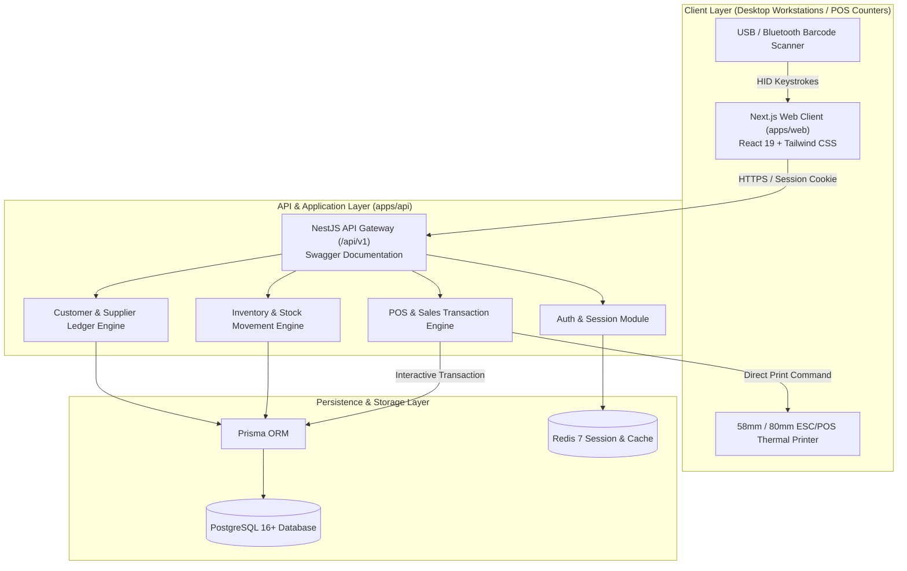
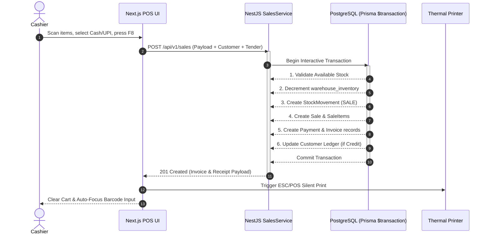

# System Architecture Diagrams

## 1. End-to-End System Context Diagram

---

## 2. POS Checkout Transaction Boundary Diagram

---

## Source Reference
* Authoritative Specification: [.ai/ARCHITECTURE.md](../../.ai/ARCHITECTURE.md)
