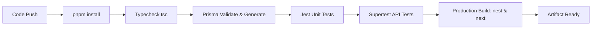

# CI/CD Pipeline Specification

## 1. Quality Gates in Automated Pipeline

Every pull request and merge to `main` must pass the following sequence:



---

## 2. Pipeline Execution Commands
```bash
# Install dependencies
pnpm install

# Typecheck all apps
pnpm run typecheck

# Execute test suite
pnpm run test

# Execute production builds
pnpm run build
```

---

## Source Reference
* Authoritative Specification: [.ai/CODING_RULES.md](../../.ai/CODING_RULES.md)
