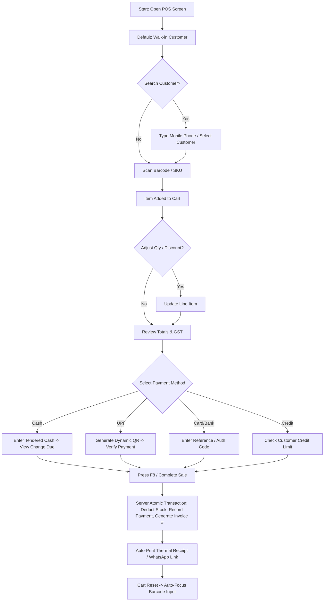
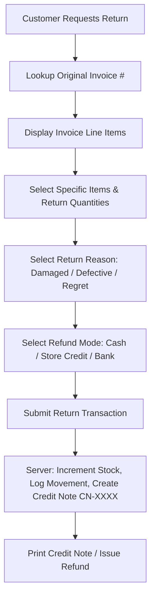
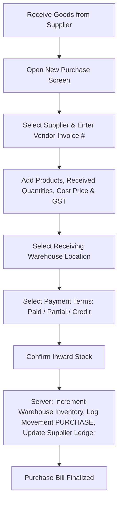
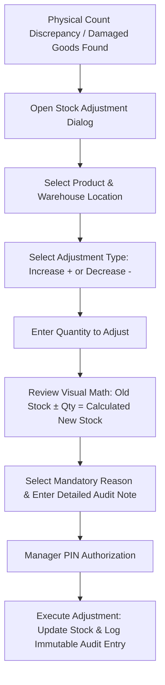

# User Flows

This document visualizes key operational workflows across IMS.

## 1. High-Velocity POS Counter Checkout Flow

---

## 2. Sales Return & Restocking Flow

---

## 3. Inward Procurement (Purchase) Flow

---

## 4. Stock Adjustment Flow (High-Impact)

---

## Source Reference
* Derived from: [.ai/PRODUCT_REQUIREMENTS.md](../../.ai/PRODUCT_REQUIREMENTS.md) and [.ai/ARCHITECTURE.md](../../.ai/ARCHITECTURE.md)
